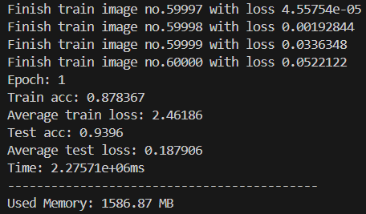
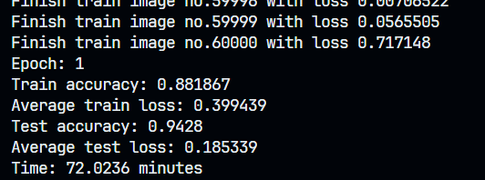
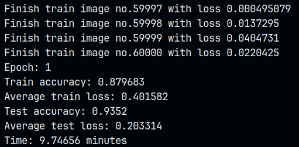
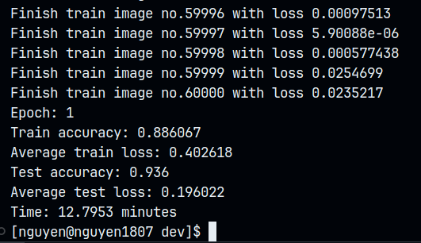

> NOTE: This project is generate with cmake-init, so writing a building instruction is a waste of time (actually I don't know how to make a build instruction).

**TL'DR**: This is the rewrite branch of my old source (few months ago), the old version took about 37 minutes to finish training and testing when the new version only took 9 minutes (insane improvement).

---

The old version

---

The new version but without optimization flag (took about 72 minutes LOL).

---

The new version but using `-Ofast` optimization flag.

---

The new version with `-O2` optimization flag.

---

Seeing more on my blog: https://lenguyen.vercel.app/projects/cpp-nn