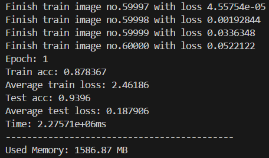
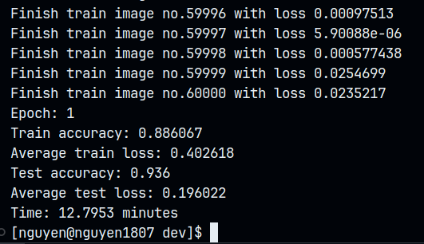
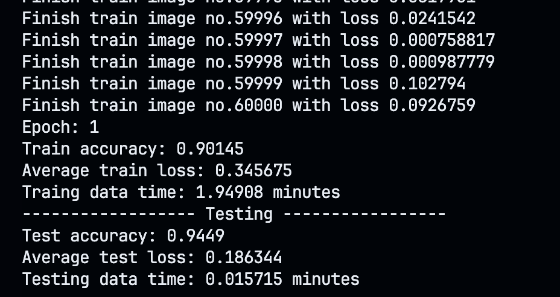
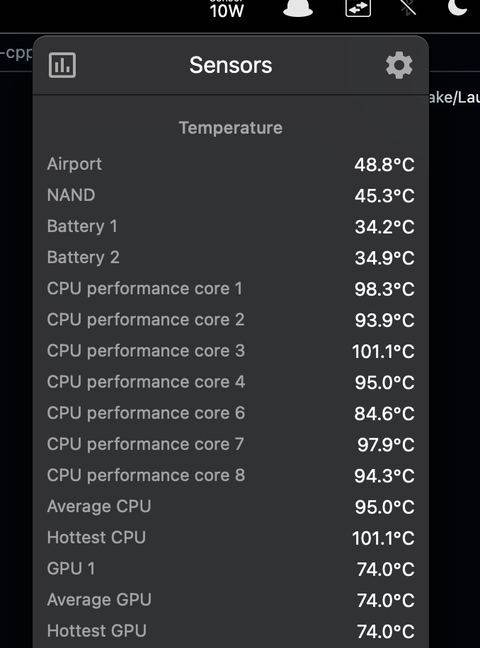

> NOTE: This code has been test only on MacOS (but maybe can work on Linux, remember I do not support Windows so you should know what to do if you want to run this on Windows).

You need to install `OpenMP` and `OpenCV`. Using `brew` as below:
```cpp
brew install llvm
brew install libomp
brew install opencv
```

**TL'DR**: This is the (another) rewrite branch of my old source (few months ago), the old version took about 37 minutes to finish training and testing when the new version only took 9 minutes (insane improvement), but all of these are on my old machine. On my new machine (Macbook Air M2), the performance now is 2 minutes 💀. I also changed the code structure and add **dropout**, **CNN** layer.

---


The old version.

---


First rewrite version (adding BLAS).

---


Second rewrite version (improve code structures and run on Mac M2).

But the CPU got too hot (about 100C and I use power adapter, not on battery)



---

> Seeing more on my blog: https://lenguyen.vercel.app/projects/cpp-nn